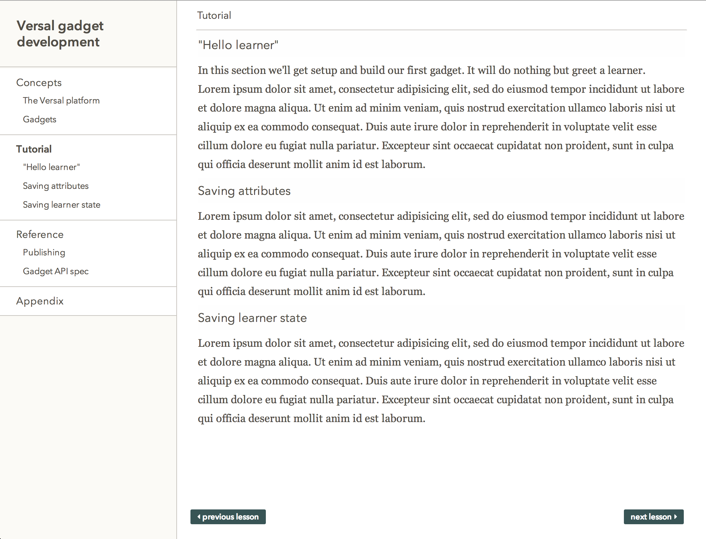

# m2v

A CLI that converts a markdown document to Versal course JSON

## The rules

* [YAML front-matter](http://jekyllrb.com/docs/frontmatter/) is used to indicate the course title 

* H1's delimit lessons. The lesson will be titled after the H1 and everything under it will be converted to section headers and markdown gadgets.

* H2's delimit sections. The section header will be titled after the H2 and everything under it will be converted to markdown gadgets.

*Note: only "#" style H1s are currently supported at this time*

## Example

```markdown
---
title: a course about things
---

# First lesson

First lesson content goes here

## First section

Some info in the first section

## Second section

Some more info in another section

# Second lesson

The second lesson needs some content too

```

## Usage

`m2v ./example.md`

## Screenshot

This is what the course generated from `./example.md` looks like



## TODO

Obviously we need to render arbitrary gadgets
